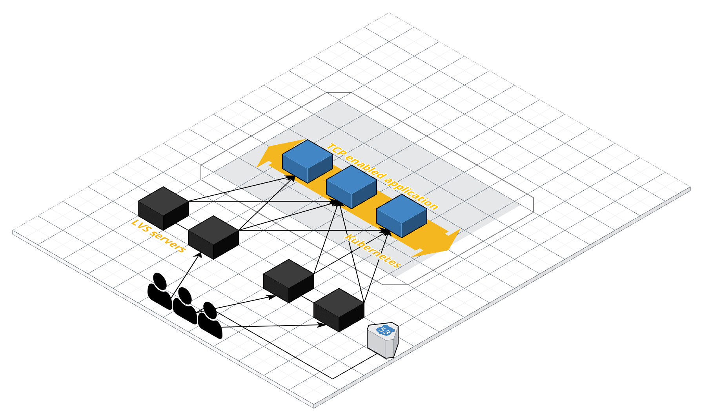

### What is it?
This simple daemon allow you to sync TCP enabled application inside in Kubernetes cluster with external LVS servers.
This is usefull only for on-premise installation of Kubernetes, then you cannot use load balancers. Like ELB.



Application create watch on update/modify/deletes of pods and update local configuration of lvs servers.
It change weights for real serves from 0 to 100 with step 20. Sleep time is configurable.
You need to run this daemon on **every** LVS server.

### Configuration
Configuration is stored in ini file `config.ini`
Avaliable options:
``lvsConfigFilePath`` - absolute path to lvs configuration
``labelToMonitorName`` - label of pods what you need to monitor (Example: `k8s-app=nginx-test`)
``labelToMonitorNamespace`` - namespace for this pod
``lvsDestionationPort`` - port of real server where you will be forward traffic
``lvsSleepTime`` - sleep time for every increment of weights

Before running this application you need to adjust this params:
lvsConfig:
`virtual` field need to be changed to you external ip.

### Installation

This GO script use dependecies defined in `Godeps` dir.
Install the dependencies:

```sh
$ cd k8s-outside-cluster-sync
$ godep load ./...
$ go run main.go
```
